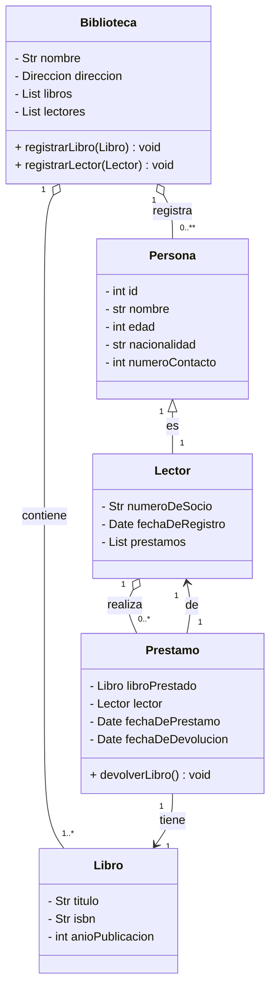

# SOLUCION CASO BIBLIOTECA

```mermaid
classDiagram
    class Biblioteca {
        - Str nombre
	    - Direccion direccion
        - List <Libro> libros
        - List <Lector> lectores
        + registrarLibro(Libro) void
        + registrarLector(Lector) void
    }
    class Libro {
        - Str titulo
        - Str isbn
        - int anioPublicacion
    }
    class Persona {
	    - int id
	    - str nombre
	    - int edad
	    - str nacionalidad
	    - int numeroContacto
    }
    class Lector {
        - Str numeroDeSocio
        - Date fechaDeRegistro
        - List <Prestamo> prestamos
    }
    class Prestamo {
        - Libro libroPrestado
        - Lector lector
        - Date fechaDePrestamo
        - Date fechaDeDevolucion
        + devolverLibro() void
    }
    Biblioteca "1" o-- "1..*" Libro : contiene
    Biblioteca "1" o-- "0..**" Persona : registra
    Persona "1" <|-- "1" Lector: es
    Lector "1" o-- "0..*" Prestamo : realiza
    Prestamo "1" --> "1" Libro : tiene
    Prestamo "1" --> "1" Lector : de
```
