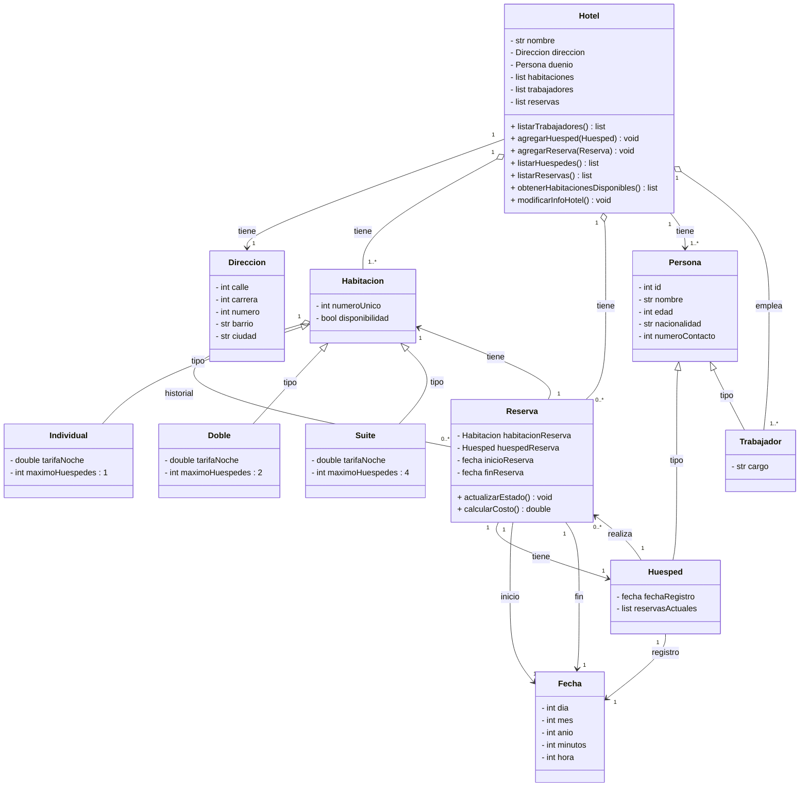
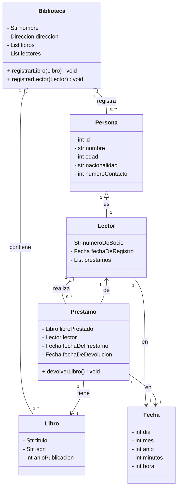

# 2.-Dise-o-Orientado-a-Objetos

Primer acercamiento y prácticas guiadas e individuales de POO

# SOLUCION CASO HOTEL

### Karen Nicolle Arango Valencia

```mermaid
classDiagram
direction TB
    class Hotel {
	    - str nombre
	    - Direccion direccion
	    - Persona duenio
	    - list habitaciones
	    - list trabajadores
	    - list reservas
        + listarTrabajadores() list<Trabajador>
	    + agregarHuesped(Huesped) void
	    + agregarReserva(Reserva) void
        + listarHuespedes() list<Huesped>
        + listarReservas() list<Reserva>
        + obtenerHabitacionesDisponibles() list<Habitacion>
        + modificarInfoHotel() void
    }
    class Direccion {
	    - int calle
	    - int carrera
	    - int numero
	    - str barrio
	    - str ciudad
    }
    class Habitacion {
	    - int numeroUnico
	    - bool disponibilidad
    }
    class Individual {
	    - double tarifaNoche
	    - int maximoHuespedes : 1
    }
    class Doble {
	    - double tarifaNoche
	    - int maximoHuespedes : 2
    }
    class Suite {
	    - double tarifaNoche
	    - int maximoHuespedes : 4
    }
    class Persona {
	    - int id
	    - str nombre
	    - int edad
	    - str nacionalidad
	    - int numeroContacto
    }
    class Huesped {
	    - fecha fechaRegistro
        - list reservasActuales
    }
    class Trabajador {
        - str cargo
    }
    class Reserva {
	    - Habitacion habitacionReserva
	    - Huesped huespedReserva
	    - fecha inicioReserva
	    - fecha finReserva
        + actualizarEstado() void
        + calcularCosto() double
    }
    class Fecha {
	    - int dia
	    - int mes
	    - int anio
	    - int minutos
	    - int hora
    }
    Hotel "1" --> "1" Direccion : tiene
    Hotel "1" o-- "1..*" Habitacion : tiene
    Hotel "1" o-- "0..*" Reserva : tiene
    Hotel "1" --> "1..*" Persona : tiene
    Hotel "1" o-- "1..*" Trabajador : emplea
    Huesped "1" --> "0..*" Reserva : realiza
    Huesped "1" --> "1" Fecha : registro
    Reserva "1" --> "1" Habitacion : tiene
    Reserva "1" --> "1" Huesped : tiene
    Reserva "1" --> "1" Fecha : inicio
    Reserva "1" --> "1" Fecha : fin
    Habitacion "1" o-- "0..*" Reserva : historial
    Habitacion <|-- Individual : tipo
    Habitacion <|-- Doble : tipo
    Habitacion <|-- Suite : tipo
    Persona <|-- Huesped : tipo
    Persona <|-- Trabajador : tipo
```

# SOLUCION CASO BIBLIOTECA

```mermaid
classDiagram
    class Biblioteca {
        - Str nombre
	    - Direccion direccion
        - List <Libro> libros
        - List <Lector> lectores
        + registrarLibro(Libro) void
        + registrarLector(Lector) void
    }
    class Libro {
        - Str titulo
        - Str isbn
        - int anioPublicacion
    }
    class Persona {
	    - int id
	    - str nombre
	    - int edad
	    - str nacionalidad
	    - int numeroContacto
    }
    class Lector {
        - Str numeroDeSocio
        - Fecha fechaDeRegistro
        - List <Prestamo> prestamos
    }
    class Prestamo {
        - Libro libroPrestado
        - Lector lector
        - Fecha fechaDePrestamo
        - Fecha fechaDeDevolucion
        + devolverLibro() void
    }
    class Fecha {
	    - int dia
	    - int mes
	    - int anio
	    - int minutos
	    - int hora
    }
    Biblioteca "1" o-- "1..*" Libro : contiene
    Biblioteca "1" o-- "0..**" Persona : registra
    Persona "1" <|-- "1" Lector: es
    Lector "1" o-- "0..*" Prestamo : realiza
    Lector "1" --> "1" Fecha : en
    Prestamo "1" --> "1" Libro : tiene
    Prestamo "1" --> "1" Lector : de
    Prestamo "1" --> "1" Fecha : en
```
